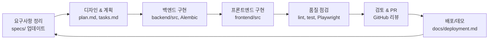

# AI TravelTailor

개인 맞춤형 여행 일정을 30초 이내에 생성해 주는 AI 기반 웹 애플리케이션입니다. FastAPI 백엔드와 Next.js 프론트엔드를 분리된 리포지토리 구조로 유지하며, Supabase·OpenAI·Google Places·Mapbox 등 외부 서비스를 통합합니다.

## 아키텍처 개요
- **backend/**: FastAPI + SQLAlchemy + LangChain. 인증, 일정 생성, 외부 API 연동, PDF/지도 데이터를 제공하는 핵심 서비스.
- **frontend/**: Next.js 14 + React 18. 여행 조건 입력, 일정 시각화, 지도/다운로드 UI를 담당.
- **shared/**: 프론트엔드·백엔드 간 공유 타입/스키마.
- **docs/** & **specs/**: 요구사항, 설계, 작업 계획, 품질 체크리스트.

## 빠른 시작
1. **리포지토리 클론**
   ```bash
   git clone <repo-url>
   cd traveltailor
   ```
2. **환경 변수 템플릿 복사**
   ```bash
   cp backend/.env.example backend/.env
   cp frontend/.env.local.example frontend/.env.local
   ```
   필수 값: Supabase(PostgreSQL) URL/키, OpenAI API 키, Google Places/Mapbox/Skyscanner API 키, Booking.com 제휴 ID, Agoda API 키, 백엔드/프론트엔드 도메인.
3. **백엔드 의존성 설치 및 서버 실행**
   ```bash
   cd backend
   uv venv
   source .venv/bin/activate            # Windows: .venv\Scripts\activate
   uv pip install -e ".[dev]"
   uv run alembic upgrade head          # 스키마 최신화
   uv run uvicorn src.main:app --reload --host 0.0.0.0 --port 8000
   ```
4. **프론트엔드 의존성 설치 및 개발 서버 실행**
   ```bash
   cd ../frontend
   pnpm install                         # npm 사용 시 npm install
   pnpm dev                             # http://localhost:3000
   ```

## 개발 플로우



## 품질 및 테스트
- **Backend**
  ```bash
  uv run ruff check src/ tests/
  uv run black src/ tests/
  uv run mypy src/
  uv run pytest
  ```
- **Frontend**
  ```bash
  pnpm lint
  pnpm type-check
  pnpm exec playwright test            # 필요 시 E2E 테스트
  ```
- **성능/운영**: AI 파이프라인 SLA(30초)를 검증할 성능 테스트 플랜은 `specs/001-ai-travel-planner/tasks.md`의 T126a에서 추적합니다.

## 디렉터리 구조
```
backend/      FastAPI 서비스, Alembic 마이그레이션, 테스트
frontend/     Next.js 앱, UI 컴포넌트, 테스트
shared/       공용 타입/스키마
docs/         배포, 외부 API, 품질 관련 문서
specs/        기능 명세, 구현 계획, 작업 보드
```

## 주요 문서
- 기능 명세: `specs/001-ai-travel-planner/spec.md`
- 구현 계획: `specs/001-ai-travel-planner/plan.md`
- 작업 목록: `specs/001-ai-travel-planner/tasks.md`
- 외부 API 정리: `docs/` (예: `docs/external-apis.md` 추가 예정)

## 외부 서비스 체크리스트
- Supabase: Database URL, anon key, service key
- OpenAI: GPT-4o 또는 동급 모델 키
- Google Places / Mapbox: 지도 & 장소 데이터 토큰
- Skyscanner/Booking 등 항공·숙박 API: 제휴 계약/쿼터 확보

각 서비스의 비용·레이트 리밋·폴백 시나리오는 플랜 문서와 작업 보드의 관련 항목(T029a/T029b/T031d 등)을 참조해 지속적으로 업데이트합니다.
